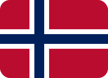

### Hi, I'm Lars Wien Tynes &nbsp;

Based in Oslo, Norway.

I'm a developer and project manager at Trust Here AS. I build privacy-first software where people stay in control of their own data.

My path into software wasn't a straight line. I spent a decade in logistics, sales and team leadership. I built a B2C delivery service from the ground up and ran B2B logistics as a project lead. Then I paired all of that with proper study in programming and digital economics, and that mix of hands-on project management and technical depth is what brought me to Trust Here AS. Long term I want to keep combining the two, drive innovation and lead IT projects.

#### Education

<picture>
  <source media="(prefers-color-scheme: dark)" srcset="assets/uio-white.svg">
  
</picture>

- **MSc, Digital Economics and Leadership (DIGØK)**, 2025 to present
- **BSc, Programming and Systems Architecture**, 2023 to present. Winner of the MET Prize 2025 for best application, SOAR.

<picture>
  <source media="(prefers-color-scheme: dark)" srcset="assets/kristiania-white.svg">
  
</picture>

- **BSc, Leadership and Service Strategy**, 2014 to 2017

#### Connect

